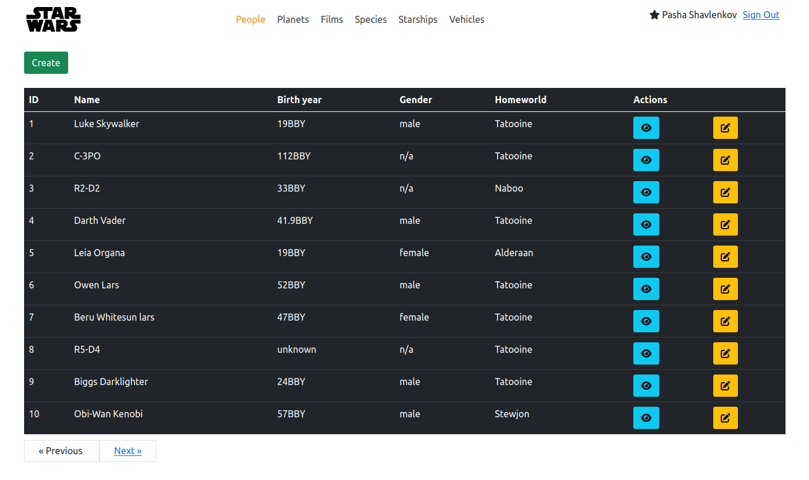

# Star Wars

### Showcase

 

### About project
**Star Wars** is a project about all the characters from the movie **"Star Wars"**.
It's main essence is to show information about all characters, planets, films in the form of an api. You can create, edit and delete a character, as well as attach pictures to it.

### How does the project work?
Our project works very simply, it takes data from [swapi](https://swapi.dev "swapi") in JSON format and puts it into a database

### Requirements for launching the project
To start the project, you will need:
1. PHP >= **8.3.7**
2. Laravel >= **10**
3. Composer >= **2.7.1**
4. Docker >= **26.0.0**
5. Docker Compose >= **1.29.2**

### How to launch the project?
1. Clone a repository:

   `git clone https://github.com/shavlenkov/star_wars.git`
2. Go to the star_wars folder:

   `cd star_wars`
3. Make an .env file from the .env.example file:

   `cp .env.example .env`
4. Install all dependencies using Composer:

   `composer install`
5. Run containers using Docker Compose:

   `docker-compose up -d`
6. Connect to the container:

   `docker exec -it star_wars_laravel.test_1 bash`
    1. Give the correct access rights to the bootstrap folder:

       `chmod -R 775 ./bootstrap ./storage`
    2. Generate App Key:

       `php artisan key:generate`
    3. Run migrations and seeders:

       `php artisan migrate --seed`
    4. Create symbolic link:
        
       `php artisan storage:link`
7. Open a browser and go to the address:
   [http://localhost:8000/signin](http://localhost:8000/signin "http://localhost:8000/signin")
